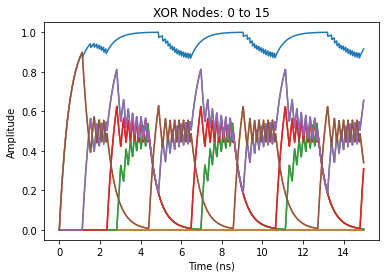

# networkm
> Network Models based on networkx MultiDiGraph objects endowed with dynamics. `Graph Functions` contains various manipulation tools for MultiDiGraphs. `Model Functions` contains methods of simulating these graphs as coupled, time-delayed differential equations with noise. `Network Class` contains the culmination of these functions in a single class object for pipelined analysis. 


## Install

NYI: `pip install networkm`

## How to use

NYI: Check out the other pages for examples

```python
m=BooleanNetwork()
```

    bool_integral : Elapsed time: 0.0104 seconds
    





```python
m
```


    <networkm.network_class.BooleanNetwork object at 0x0000026272339508>
    |Node|Predecessors|Successors|
    |0   |16, 17, 31  |16        |
    |1   |16, 17, 18  |17        |
    |2   |17, 18, 19  |18        |
    |3   |18, 19, 20  |19        |
    ...
    |28  |12          |11, 13, 12|
    |29  |13          |12, 14, 13|
    |30  |14          |13, 15, 14|
    |31  |15          |14, 0, 15 |


